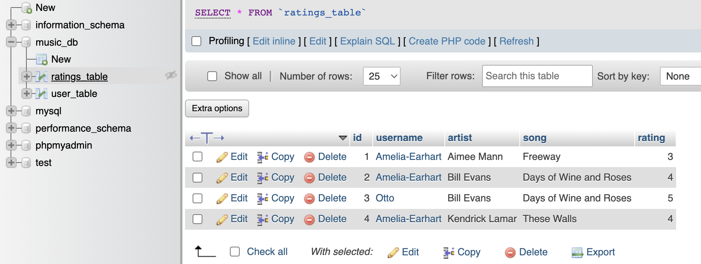

# COMP333_HW4
Backend for our HW4 Frontend Mobile (React-Native)

Sydney Keller (<smkeller@wesleyan.edu>)
Minji Woo (<mwoo@wesleyan.edu>)

# Purpose:
Connect user to SQL database through REST API

# Setting up the developement environment:
1. Git clone into htdocs
2. Make sure your general structure of files is as follows: XAMPP/xamppfiles/htdocs/COMP333_HW4
3. Setting up MySQL database, local XAMPP dev environment, and phpMyAdmin:

- Screenshot of local XAMPP developement environment 
 

- Screenshot of user table structure
 

- Screenshot of an example of user table data
 

- Screenshot of ratings table structure
 

- Screenshot of an example of ratings table data
 
4. Through XAMPP, make sure MySQL Database and Apache Web Server are running

# How to run the code:
Make sure you are running MySQL Database through XAMPP to connect to the database for when runnning unit tests. 

# Folders and Files:
## Rest API/Model, View, Controller Architecture:
index.php: the entry-point of our application, front-controller of application. index.php connects to UserController.php for all interactions with database 
inc:
 - config.php: holds the configuration information of application, holds the database credentials. 
 - bootstrap.php: used to bootstrap  application by including the necessary files
 <!-- end of the list -->
Model:
- Database.php: the database access layer which will be used to interact with the underlying MySQL database.
- UserModel.php: the User model file which implements the necessary methods to interact with the users table in the MySQL database.
<!-- end of the list -->
Controller/Api:
- BaseController.php: a base controller file which holds common utility methods.
- UserController.php: the User controller file which holds the necessary application code to entertain REST API calls. Creates a user, logs a user in, gets data from ratings table for user, deletes, adds, and updates ratings for user.
<!-- end of the list -->
test-project:
- tests:
    - UserListTest.php: request the current user list with a GET request and check that the server responds with a 200 response code.
    - CreateUserTest.php: request the creation of a user with a POST request and check that the server responds with a 201 response code.
    - FailedLoginTest.php: test the failed login of a user with a POST request and check that the server responds with a 201 response code.
    - LoginUserTest.php: test the successful login of a user with a POST request and check that the server responds with a 201 response code.
    - DeleteSongTest.php: request the deletion of a song with a POST request and check that the server responds with a 200 response code.
    - NewSongTest.php: request the creation of a new song with a POST request and check that the server responds with a 201 response code.
    - UpdateSongTest.php: request the update of a song with a POST request and check that the server responds with a 200 response code.
- composer.json: comes with PHPUnit/composer
- composer.lock: comes with PHPUnit/composer 
- src: empty folder, comes with PHPUnit/composer
- vendor: folder + files that come with PHPUnit/composer, helps run tests

<!-- end of the list -->
Checkout this tutorial for how more details on how we set up our REST API:
https://code.tutsplus.com/how-to-build-a-simple-rest-api-in-php--cms-37000t

## Other files:
Images:
- Sydney_XAMPP - Screenshot of local XAMPP developement environment
- Sydney_user_table_structure.png - Screenshot of user_table structure from phpMyAdmin
- Sydney_user_table.png - Screenshot of user_table from phpMyAdmin
- Sydney_ratings_table_structure.png - Screenshot of ratings_table structure from phpMyAdmin
- Sydney_ratings_table.png - Screenshot of ratings_table from phpMyAdmin